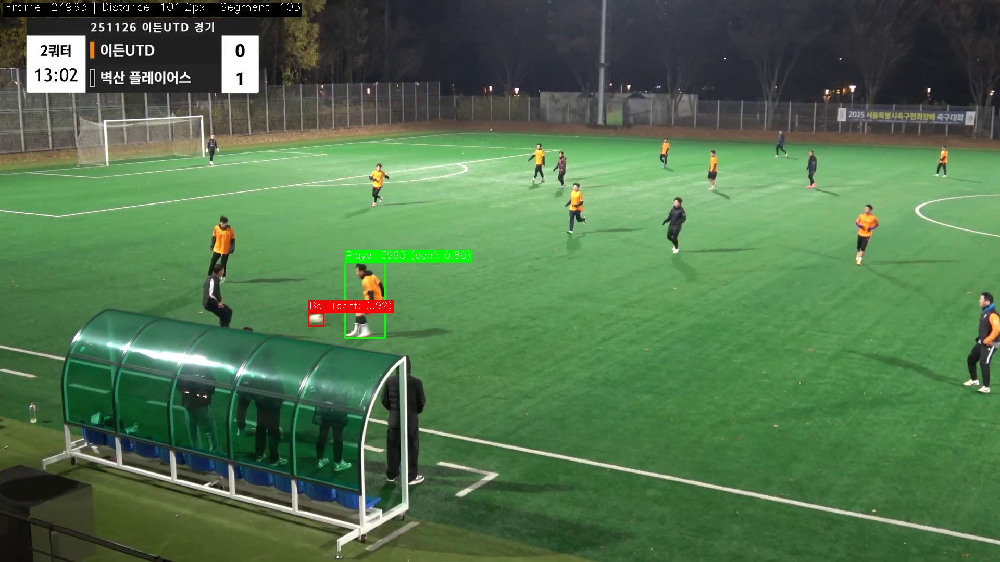
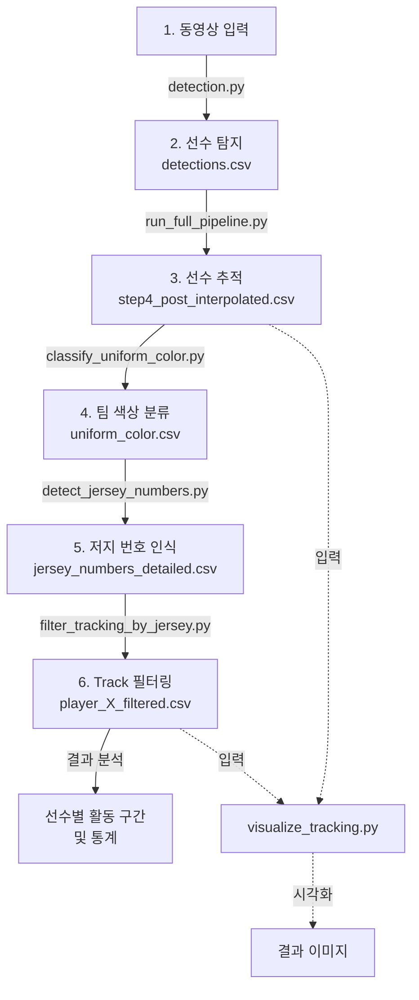

# Soccer Analysis Pipeline

YOLO 기반의 축구 경기 분석 시스템입니다. 선수 탐지, 추적, 유니폼 인식 및 활동 구간 추출을 통해 종합적인 경기 분석을 제공합니다.

## 프로젝트 구조

```
Soccer/
├── detection.py                 # YOLO 기반 선수 탐지
├── yolo11x.pt                   # YOLO11x 모델 가중치
├── run_full_pipeline.py         # 4단계 추적 파이프라인 (SORT + Re-ID)
├── visualize_tracking.py        # 추적 결과 시각화
├── results/                     # 탐지 결과 디렉토리
└── README.md
```

## 설치 및 사용

### 1. 의존성 설치

```bash
pip install ultralytics opencv-python numpy pandas scikit-learn
```

### 2. 기본 실행 흐름

```bash
# 1단계: 선수 탐지
python detection.py --input video.mp4 --output results/

# 2단계: 선수 추적 및 Re-ID
python run_full_pipeline.py \
  --detections results/detections.csv \
  --frames-dir results/frames \
  --output-dir tracking_results/

# 3단계: 결과 시각화
python visualize_tracking.py tracking_results/step4_post_interpolated.csv \
  --frames-dir results/frames \
  --output-dir tracking_results/visualization
```

---

## 핵심 기능

### 1️⃣ 선수 탐지 (Player Detection)

**detection.py** - YOLO11x 기반 실시간 선수 탐지

- 동영상 프레임에서 선수 위치 탐지
- 각 선수에 대해 bounding box 및 신뢰도 점수 제공
- CSV 형식으로 탐지 결과 저장

---

### 2️⃣ 선수 추적 (Player Tracking)

**run_full_pipeline.py** - 4단계 멀티스케일 추적 파이프라인

#### 파이프라인 구성

1. **SORT Tracking** - 단거리 tracklet 생성
2. **Tracklet Interpolation** - ID별 결손 프레임 보간
3. **Re-ID 기반 병합** - 같은 선수의 끊긴 track 통합
4. **Post-Interpolation** - 병합 후 최종 보간

#### 입력/출력

**입력:**
- `--detections` : 탐지 결과 CSV (필수)
- `--frames-dir` : 원본 프레임 이미지 폴더 (필수)
- `--output-dir` : 결과 저장 경로 (기본값: tracking_results)
- `--start-frame`, `--end-frame` : 처리 프레임 범위
- `--max-age`, `--min-hits` : SORT 파라미터

**출력:**
```
tracking_results/
├── step1_sort_raw.csv              # SORT 초기 추적
├── step2_interpolated.csv          # 보간 후 추적
├── step3_reid_merged.csv           # Re-ID 병합 후
├── step4_post_interpolated.csv     # 최종 추적 결과 ⭐
└── reid_features.pkl               # Re-ID 특징 벡터
```

#### 실행 예시

```bash
python run_full_pipeline.py \
  --detections detection_results/detections.csv \
  --frames-dir detection_results/frames \
  --output-dir tracking_results \
  --start-frame 0 \
  --end-frame 1000
```

---

### 3️⃣ 유니폼 분류 (Uniform Classification)

**classify_uniform_color.py** - HSV 기반 팀 색상 분류

각 추적된 선수의 유니폼 색상을 자동으로 분류합니다.

#### 기능
- bbox의 상체 영역에서 주도적 색상 추출
- 지원 팀 색상: **주황색(Orange)**, **검은색(Black)**
- 배경(잔디, 피부)색 자동 제외
- 신뢰도 점수와 함께 분류 결과 저장

#### 입력/출력

**입력:**
- `--detection_csv` : 탐지 결과 CSV (필수)
- `--image_folder` : 프레임 이미지 폴더 (필수)
- `--upper_ratio` : 상체 영역 비율 (기본값: 0.5 = 상위 50%)

**출력:**
```csv
frame,image_name,track_id,x1,y1,x2,y2,confidence,uniform_color,color_confidence
0,frame_000000.jpg,1,100,150,200,350,0.95,orange,0.876
0,frame_000000.jpg,2,400,100,550,400,0.92,black,0.923
```

#### 실행 예시

```bash
python classify_uniform_color.py \
  --detection_csv detection_results/detections.csv \
  --image_folder detection_results/frames \
  --output_csv detection_results/uniform_color.csv \
  --upper_ratio 0.5
```

---

### 4️⃣ 저지 탐지 (Jersey Detection)

**detect_jersey_numbers.py** - EasyOCR 기반 유니폼 번호 인식

유니폼에서 선수 번호를 자동으로 인식합니다.

#### 기능
- **팀 필터링**: Orange 팀만 선택적 처리
- **다중 영역 검출**: Chest(앞면) / Back(뒷면) 적응형 인식
- **이미지 전처리**: CLAHE, 샤프닝, 적응형 이진화 등
- **검증**: 유효한 번호 범위(1-99) 및 신뢰도 필터링
- **샘플링 전략**: Quality/Uniform/All 3가지 샘플링 방식
- **투표 기반 통합**: 다중 프레임 검출 결과 통합

#### 입력/출력

**입력:**
- `--color_csv` : 유니폼 색상 분류 결과 CSV (필수)
- `--frames_dir` : 프레임 이미지 폴더 (필수)
- `--team_color` : 필터링 팀 색상 (기본값: orange)
- `--min_color_confidence` : 최소 색상 신뢰도 (기본값: 0.15)
- `--sampling_strategy` : all / quality / uniform (기본값: quality)

**출력:**
```
detection_results/
├── jersey_numbers_detailed.csv     # 프레임별 상세 결과
└── jersey_numbers_consolidated.csv # track_id별 통합 결과
```

**jersey_numbers_consolidated.csv:**
```csv
track_id,jersey_number,consolidated_confidence,detection_count,first_frame,last_frame
1,10,85.234,12,100,450
2,7,91.456,18,50,480
```

#### 실행 예시

```bash
# 기본 실행 (Quality sampling)
python detect_jersey_numbers.py \
  --color_csv detection_results/uniform_color.csv \
  --frames_dir detection_results/frames \
  --output_dir detection_results/

# 모든 프레임 처리
python detect_jersey_numbers.py \
  --color_csv detection_results/uniform_color.csv \
  --frames_dir detection_results/frames \
  --output_dir detection_results/ \
  --sampling_strategy all
```

---

### 🎯 Track 필터링 (Filter Tracking by Jersey)

**filter_tracking_by_jersey.py** - 저지 번호 기반 추적 결과 필터링

특정 저지 번호를 가진 선수의 추적 데이터만 추출합니다.

#### 기능
- **IoU 기반 Bbox 매칭**: 추적 결과와 저지 검출 결과의 공간적 일치도 평가
- **선수 식별**: 저지 번호와 일치하는 track_id만 필터링
- **정보 통합**: 추적 데이터에 팀 색상/저지 번호 정보 추가
- **다양한 필터링**: 색상 신뢰도, Bbox 크기 등으로 사전 필터링 가능

#### 작동 원리

```
1. 저지 검출 CSV 로드 + 팀 색상 필터링
   └─ 예: jersey_number == "10" AND uniform_color == "orange"

2. 추적 결과 CSV 로드

3. Frame 및 IoU 기반 Bbox 매칭
   ├─ 같은 프레임에서 추적 bbox와 저지 bbox 비교
   ├─ IoU >= threshold (기본값: 0.9) 인 경우 일치로 판정
   └─ 일치하는 track_id 추출

4. Track ID 기반 필터링
   └─ 저지 번호와 일치하는 선수의 전체 track 데이터 추출

5. 정보 통합 및 저장
   └─ 추적 결과에 팀/저지 정보 추가
```

#### 입력/출력

**입력:**
- `--tracking` : 추적 결과 CSV (예: step4_post_interpolated.csv) (필수)
- `--jersey` : 저지 검출 CSV (jersey_numbers_detailed.csv) (필수)
- `--number` : 필터링할 저지 번호 (기본값: "10")
- `--iou` : IoU threshold (기본값: 0.9)

**출력:**
```csv
frame,track_id,x1,y1,x2,y2,confidence,uniform_color,color_confidence,jersey_number,number_confidence,crop_region_type
100,1,120,160,220,380,0.94,orange,0.876,10,0.92,chest
101,1,125,165,225,385,0.93,orange,0.879,10,0.89,chest
150,1,130,170,230,390,0.92,orange,0.882,10,0.94,back
```

#### 실행 예시

```bash
# 저지 번호 10번 선수만 필터링
python filter_tracking_by_jersey.py \
  --tracking tracking_results/step4_post_interpolated.csv \
  --jersey detection_results/jersey_numbers_detailed.csv \
  --number 10 \
  --output tracking_results/player_10_filtered.csv

# IoU threshold 조정 (더 엄격한 매칭)
python filter_tracking_by_jersey.py \
  --tracking tracking_results/step4_post_interpolated.csv \
  --jersey detection_results/jersey_numbers_detailed.csv \
  --number 7 \
  --iou 0.95 \
  --output tracking_results/player_7_filtered.csv
```

#### 출력 통계

```
================================================================================
Track IDs matching jersey #10: 3
================================================================================
Track IDs: [1, 45, 89]

Track Details:
  Track 1: 245 frames (frame 100 - 450)
  Track 45: 89 frames (frame 1200 - 1350)
  Track 89: 156 frames (frame 2100 - 2300)

================================================================================
Complete!
================================================================================
Input tracking rows: 45000
Output tracking rows: 490
Reduction: 98.9%
Unique track_ids in output: 3
```

---

### 5️⃣ 출현 구간 추출 (Appearance Duration Extraction)

각 선수의 활동 시간대 추출

**목표:**
- 각 track ID별로 첫 등장 프레임과 마지막 등장 프레임 기록
- 활동 시간대 요약 (시작 시간, 종료 시간, 총 플레이 시간)
- 교체 또는 부상으로 인한 퇴장 분석

**출력 예시:**
```
player_id | team | jersey_number | first_frame | last_frame | duration | appearance_count
    1     |  A   |      10       |     0       |    2500    |   2500   |      2345
    2     |  B   |       7       |    150      |    2400    |   2250   |      2100
```

---

### ⚽ 결과 시각화 (Visualization)

**visualize_tracking.py** - 추적 결과를 프레임 이미지에 렌더링

**기능:**
- 선수별 bounding box 그리기
- Track ID 표시
- 선택적으로 팀 색상 / 저지 번호 표시

**입력:**
- 추적 결과 CSV (예: step4_post_interpolated.csv)
- 원본 프레임 이미지 폴더

**출력:**
- 주석이 추가된 프레임 이미지들

**실행 예시:**

```bash
python visualize_tracking.py \
  tracking_results/step4_post_interpolated.csv \
  --frames-dir detection_results/frames \
  --output-dir tracking_results/visualization
```

#### 예시 결과

**선수 탐지 및 추적 결과:**



**유니폼 번호(NO.10) 추적 프레임 분포:**

.png)

---

## 파이프라인 워크플로우



## 실행 순서 (Complete Pipeline)

```bash
# 1단계: 선수 탐지
python detection.py \
  --input video.mp4 \
  --output detection_results/

# 2단계: 선수 추적
python script/run_full_pipeline.py \
  --detections detection_results/detections.csv \
  --frames-dir detection_results/frames \
  --output-dir tracking_results/

# 3단계: 팀 색상 분류
python script/classify_uniform_color.py \
  --detection_csv detection_results/detections.csv \
  --image_folder detection_results/frames \
  --output_csv detection_results/uniform_color.csv

# 4단계: 저지 번호 인식
python script/detect_jersey_numbers.py \
  --color_csv detection_results/uniform_color.csv \
  --frames_dir detection_results/frames \
  --output_dir detection_results/ \
  --sampling_strategy quality

# 5단계: 특정 선수 추적 필터링 (예: 번호 10)
python script/filter_tracking_by_jersey.py \
  --tracking tracking_results/step4_post_interpolated.csv \
  --jersey detection_results/jersey_numbers_detailed.csv \
  --number 10 \
  --output tracking_results/player_10_filtered.csv

# 6단계: 결과 시각화
python script/visualize_tracking.py \
  tracking_results/player_10_filtered.csv \
  --frames-dir detection_results/frames \
  --output-dir tracking_results/visualization_player10
```

---

## 🎯 추가 기능: 공 추적 (Ball Detection)

### 6️⃣ 신발 Pseudo Label 생성 (Shoe Pseudo Label Generation)

**generate_shoe_pseudo_labels.py** - 공 탐지 데이터셋에 신발 클래스 추가

공 탐지 모델의 False Positive(발을 공으로 오인식)를 줄이기 위해 **2-class 데이터셋** (Ball + Shoe)을 생성합니다.

#### 기능
- **Person Detection** + **Pose Estimation** 활용
- Ankle keypoint에서 신발 영역 Pseudo Label 자동 생성
- Ball class와 Shoe class (1 vs 1) 구분 학습
- 모든 bbox에 10% padding 자동 적용
- 시각화 샘플 자동 생성

#### 동작 원리

```
1. 각 프레임에서 사람 탐지 (Person Detection)
   └─ YOLO11x 모델 사용

2. 사람별 Pose Estimation (Ankle keypoint 추출)
   └─ YOLO11x-pose 모델 사용
   └─ 양쪽 발 (Left Ankle, Right Ankle) keypoint 추출

3. Ankle 기반 Shoe Bbox 생성
   ├─ Person bbox 크기에 비례하여 동적 조정
   ├─ Ankle 기준으로 위쪽 30%, 아래쪽 70%로 배치
   └─ 이미지 하단 영역만 포함 (필터링 가능)

4. 기존 Ball Label + 생성된 Shoe Label 병합
   └─ YOLO 정규화 형식으로 저장

5. data.yaml 자동 생성
   └─ 2-class 데이터셋 설정
```

#### 입력/출력

**입력:**
- `--input_dir` : Ball 데이터셋 경로 (train/valid/test 폴더 포함)
- `--person_model` : YOLO11x 모델 경로 (기본값: yolo11x.pt)
- `--pose_model` : YOLO11x-pose 모델 경로 (기본값: yolo11x-pose.pt)
- `--bbox_size_ratio` : Person bbox 대비 Shoe bbox 크기 (기본값: 0.1 = 10%)
- `--bottom_ratio` : 이미지 하단 영역 필터링 비율 (기본값: 1.0 = 전체)
- `--padding_ratio` : Bbox 패딩 비율 (기본값: 0.1 = 10% 패딩)

**출력:**
```
ball_shoe/merged/
├── train/
│   ├── images/       # 원본 이미지
│   └── labels/       # Ball + Shoe label
├── valid/
│   ├── images/
│   └── labels/
├── test/
│   ├── images/
│   └── labels/
├── visualization/    # 샘플 시각화 (선택사항)
└── data.yaml         # 2-class 데이터셋 정의
```

**data.yaml 내용:**
```yaml
names:
- ball
- shoe
nc: 2
train: train/images
val: valid/images
test: test/images
```

#### 실행 예시

```bash
# 기본 설정으로 실행
python generate_shoe_pseudo_labels.py

# 커스텀 경로 및 파라미터
python generate_shoe_pseudo_labels.py \
  --input_dir /path/to/ball/merged \
  --output_dir /path/to/ball_shoe/merged \
  --bbox_size_ratio 0.1 \
  --padding_ratio 0.1 \
  --visualize \
  --viz_count 50

# 이미지 하단 30% 영역만 처리
python generate_shoe_pseudo_labels.py \
  --bottom_ratio 0.3 \
  --visualize
```

#### 라벨 형식

**원본 Ball Label (class 0):**
```
0 0.512 0.412 0.025 0.035
0 0.678 0.512 0.032 0.042
```

**생성된 라벨 (Ball + Shoe):**
```
0 0.512 0.412 0.025 0.035     # Ball (기존)
0 0.678 0.512 0.032 0.042     # Ball (기존)
1 0.234 0.891 0.045 0.055     # Shoe (생성)
1 0.756 0.895 0.048 0.058     # Shoe (생성)
```

---

### 7️⃣ 공-선수 근접 구간 추출 (Ball-Player Proximity Extraction)

**extract_ball_player_proximity.py** - 공과 선수가 가까운 프레임 필터링

경기의 핵심 장면(공이 선수 근처)을 추출하여 하이라이트 영상 생성에 활용합니다.

#### 기능
- **공과 선수의 거리 기반 필터링**: Center-to-center 거리 계산
- **연속 구간 자동 식별**: 프레임 갭 감지로 Segment 생성
- **통계 정보 제공**: 거리, 프레임 범위 등

#### 작동 원리

```
1. 선수 추적 CSV + 공 탐지 CSV 로드
   ├─ 선수 데이터: frame, track_id, x1, y1, x2, y2, ...
   └─ 공 데이터: frame, x1, y1, x2, y2, confidence, ...

2. Frame 기반 Inner Join
   └─ 같은 프레임에서 선수와 공이 모두 탐지된 경우만 유지

3. 중심점 거리 계산
   ├─ Player center: ((x1+x2)/2, (y1+y2)/2)
   ├─ Ball center: ((ball_x1+ball_x2)/2, (ball_y1+ball_y2)/2)
   └─ Distance = √((px-bx)² + (py-by)²)

4. 거리 Threshold 필터링
   └─ distance <= threshold 인 프레임만 추출

5. 연속 구간 식별
   ├─ Frame gap > 1 인 경우 새로운 Segment 시작
   └─ 각 Segment에 ID 할당 (segment_1, segment_2, ...)
```

#### 입력/출력

**입력:**
- `--player-csv` : 필터링된 선수 추적 CSV
- `--ball-csv` : 공 탐지 결과 CSV
- `--distance-threshold` : 거리 기준값 (기본값: 100 픽셀)

**출력:**
```csv
frame,track_id,x1,y1,x2,y2,confidence,jersey_number,number_confidence,
uniform_color,color_confidence,crop_region_type,ball_x1,ball_y1,ball_x2,
ball_y2,ball_confidence,distance,segment_id
100,1,120,160,220,380,0.94,10,0.92,orange,0.876,chest,125,170,135,175,0.95,45.2,1
101,1,125,165,225,385,0.93,10,0.89,orange,0.879,chest,128,172,138,177,0.94,38.1,1
150,1,130,170,230,390,0.92,10,0.94,orange,0.882,back,500,400,510,405,0.89,999.5,2
```

#### 실행 예시

```bash
# 기본 거리 threshold (100 픽셀)
python extract_ball_player_proximity.py \
  --player-csv tracking_results/player_10_filtered.csv \
  --ball-csv results/ball_detection.csv \
  --output tracking_results/player_10_ball_proximity.csv

# 더 엄격한 threshold (50 픽셀 = 더 가까운 장면만)
python extract_ball_player_proximity.py \
  --player-csv tracking_results/player_10_filtered.csv \
  --ball-csv results/ball_detection.csv \
  --distance-threshold 50 \
  --output tracking_results/player_10_close_proximity.csv

# 넓은 threshold (200 픽셀 = 더 많은 프레임)
python extract_ball_player_proximity.py \
  --player-csv tracking_results/player_10_filtered.csv \
  --ball-csv results/ball_detection.csv \
  --distance-threshold 200 \
  --output tracking_results/player_10_wide_proximity.csv
```

#### 출력 통계

```
======================================================================
SUMMARY
======================================================================
Total frames extracted: 1245
Distance threshold: 100 pixels
Number of segments: 8

Segment details:
  Segment 1: 245 frames (frame 100 - 450)
  Segment 2: 89 frames (frame 1200 - 1350)
  Segment 3: 156 frames (frame 2100 - 2300)
  Segment 4: 120 frames (frame 2800 - 2950)
  ...

Average segment length: 155.6 frames
Frame range: 100-5234
```

#### 활용 예시

```bash
# 1단계: 선수 추적 필터링
python filter_tracking_by_jersey.py \
  --tracking tracking_results/step4_post_interpolated.csv \
  --jersey detection_results/jersey_numbers_detailed.csv \
  --number 10 \
  --output tracking_results/player_10_filtered.csv

# 2단계: 공-선수 근접 구간 추출
python extract_ball_player_proximity.py \
  --player-csv tracking_results/player_10_filtered.csv \
  --ball-csv results/ball_detection.csv \
  --distance-threshold 100 \
  --output tracking_results/player_10_ball_proximity.csv

# 3단계: 하이라이트 영상 생성 (FFmpeg 또는 OpenCV 활용)
# → Segment별로 비디오 클립 추출 및 이어붙이기
```

---

## 확장 기능 (Future Work)

- [x] **유니폼 색상 기반 팀 분류** - ✅ 구현 완료 (`classify_uniform_color.py`)
- [x] **OCR을 이용한 저지 번호 인식** - ✅ 구현 완료 (`detect_jersey_numbers.py`)
- [x] **Track 필터링** - ✅ 구현 완료 (`filter_tracking_by_jersey.py`)
- [x] **신발 Pseudo Label 생성** - ✅ 구현 완료 (`generate_shoe_pseudo_labels.py`)
- [x] **공-선수 근접 구간 추출** - ✅ 구현 완료 (`extract_ball_player_proximity.py`)
- [ ] 선수 활동 구간 통계 분석 - 향후 계획
- [ ] 선수 포지션 추정
- [ ] 골장 인식 (Pitch Detection)
- [ ] 3D 궤적 재구성

---

## 데이터 형식

### 탐지 결과 CSV (detections.csv)

```
frame_id,x1,y1,x2,y2,confidence,class
0,100,150,200,350,0.95,person
0,400,100,550,400,0.92,person
1,105,155,205,355,0.94,person
...
```

### 추적 결과 CSV (step4_post_interpolated.csv)

```
frame_id,track_id,x1,y1,x2,y2,confidence
0,1,100,150,200,350,0.95
0,2,400,100,550,400,0.92
1,1,105,155,205,355,0.94
1,2,405,105,555,405,0.91
...
```

---

## 성능 최적화

- **멀티프로세싱** : 대규모 영상 처리 시 병렬 처리 구현
- **배치 처리** : 프레임 배치로 추론 성능 향상
- **특징 캐싱** : Re-ID 특징 사전 계산 및 저장

---
